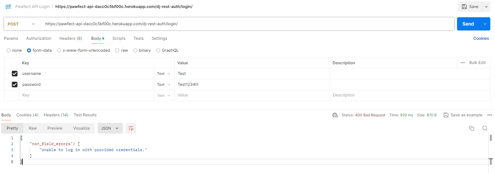
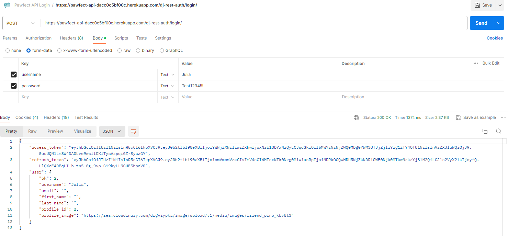
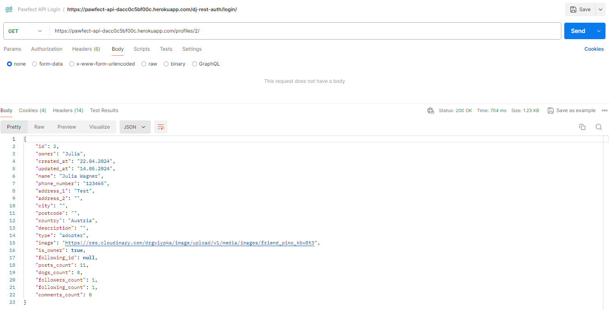
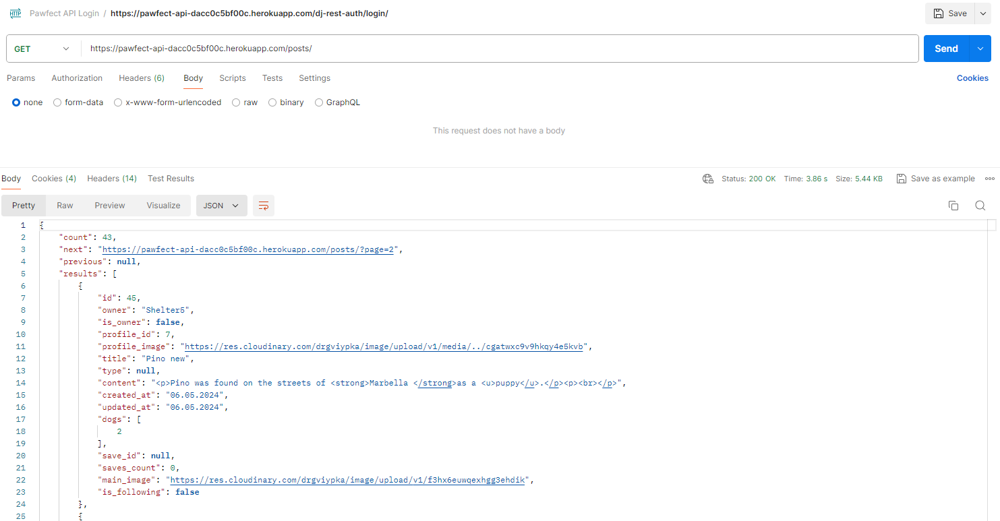
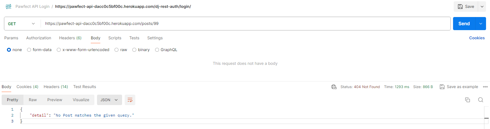
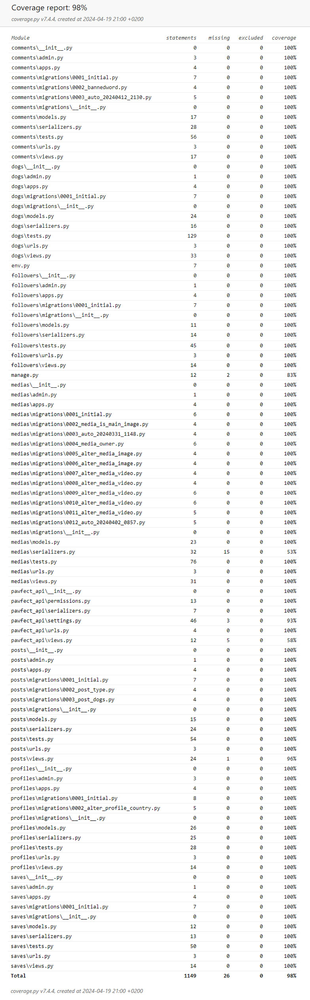
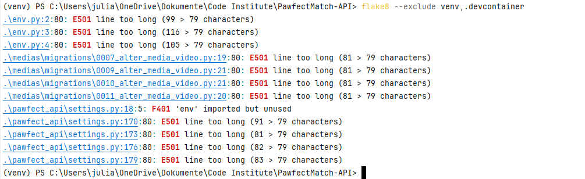

# **Testing**

[Go back to the README](README.md)

## **Table of Contents**

<!-- TOC -->
* [**Testing**](#testing)
  * [**Table of Contents**](#table-of-contents)
  * [**Manual Testing**](#manual-testing)
  * [**Automated Testing**](#automated-testing)
  * [**User Story Testing**](#user-story-testing)
  * [**Validation**](#validation)
    * [**Python Validation**](#python-validation)
  * [**Bugs and Fixes**](#bugs-and-fixes)
<!-- TOC -->

## **Manual Testing**

The best manual test was developing the frontend, as I have to send many requests to the API and inspect the response. Building the frontend helped me improve and debug backend endpoints and ensure to send relevant data.

I tested each app manually while creating the views in the DRF API interface. Additionally, I used Postman to test my endpoints, covering scenarios such as valid and invalid login attempts and CRUD operations. This process included checking for correct status codes, proper error handling, and validation rules. Here are a few screenshots of requests and responses in postman.

\
*Postman request with invalid login data*

\
*Postman request with valid login data*

\
*Postman profile request*

\
*Postman posts request*

\
*Postman post request with invalid id*

## **Automated Testing**

I created and performed automated unit tests for each app. I structured my tests according to my views and tested each HTTP request and the applicable permissions. 

I installed *coverage* to check the testing coverage for my code. Using the *.html* report, I managed to find untested parts and add tests for these.

My total coverage for my unit tests is **98%**, with **100%** for all custom apps except for two. The medias serializer can not be fully tested automatically as it checks the uploaded size and file type for the image or video. And the posts view filter to check if a post has linked dogs was not tested automatically. I made sure to test these two apps again manually.

\
*Unit test coverage*

## **User Story Testing**

In order for the **Acceptance Criteria met** to be ticked, every criterion specified in the linked project issue has to be fulfilled.

| User Story                                                                                                                                                            | Link to Acceptance Criteria                                    | Acceptance Criteria met                |
|-----------------------------------------------------------------------------------------------------------------------------------------------------------------------|----------------------------------------------------------------|----------------------------------------|
| As a **developer**, I want to **access an API endpoint for registration**, so that I can **create users and profiles**.                                               | [link](https://github.com/Julia-Wagner/PawfectMatch/issues/1)  | &check;                                |
| As a **developer**, I want to **access an API endpoint for login**, so that I can **authenticate users**.                                                             | [link](https://github.com/Julia-Wagner/PawfectMatch/issues/2)  | &check;                                |
| As a **developer**, I want to **access an API endpoint for the feed without providing a logged-in user**, so that I can **access the feed without authentication**.   | [link](https://github.com/Julia-Wagner/PawfectMatch/issues/3)  | &check;                                |
| As a **developer**, I want to **get appropriate error messages from the API in response to failed requests**, so that I can **provide users with detailed feedback**. | [link](https://github.com/Julia-Wagner/PawfectMatch/issues/4)  | &check;                                |
| As a **developer**, I want to **perform CRUD operations for profiles**, so that I can **allow users to edit their profiles**.                                         | [link](https://github.com/Julia-Wagner/PawfectMatch/issues/5)  | &check;                                |
| As a **developer**, I want to **edit and get the profile status**, so that I can **show or hide profiles**.                                                           | [link](https://github.com/Julia-Wagner/PawfectMatch/issues/6)  | Feature not included for first release |
| As a **developer**, I want to **access follow API endpoints**, so that I can **allow users to follow each other**.                                                    | [link](https://github.com/Julia-Wagner/PawfectMatch/issues/7)  | &check;                                |
| As a **developer**, I want to **perform CRUD operations for comments**, so that I can **allow users to add comments to profiles**.                                    | [link](https://github.com/Julia-Wagner/PawfectMatch/issues/8)  | &check;                                |
| As a **developer**, I want to **define banned words**, so that I can **ensure appropriate comments**.                                                                 | [link](https://github.com/Julia-Wagner/PawfectMatch/issues/9)  | &check;                                |
| As a **developer**, I want to **perform CRUD operations for posts**, so that I can **allow users to post content**.                                                   | [link](https://github.com/Julia-Wagner/PawfectMatch/issues/10) | &check;                                |
| As a **developer**, I want to **access an API endpoint for saving a post**, so that I can **provide the user with a list of saved posts**.                            | [link](https://github.com/Julia-Wagner/PawfectMatch/issues/11) | &check;                                |
| As a **developer**, I want to **have a special type of post for dogs**, so that I can **distinguish dog posts from other posts**.                                     | [link](https://github.com/Julia-Wagner/PawfectMatch/issues/12) | &check;                                |
| As a **developer**, I want to **define requirements for dogs**, so that I can **use them for filtering**.                                                             | [link](https://github.com/Julia-Wagner/PawfectMatch/issues/13) | Feature not included for first release |
| As a **developer**, I want to **mark a dog as adopted**, so that I can **correctly show posts**.                                                                      | [link](https://github.com/Julia-Wagner/PawfectMatch/issues/14) | &check;                                |
| As a **developer**, I want to **receive dogs from the API based on defined criteria**, so that I can **allow filtering and matching**.                                | [link](https://github.com/Julia-Wagner/PawfectMatch/issues/15) | &check;                                |
| As a **developer**, I want to **receive notifications from the API**, so that I can **alert the user**.                                                               | [link](https://github.com/Julia-Wagner/PawfectMatch/issues/16) | Feature not included for first release |
| As a **developer**, I want to **perform CRUD operations for chat messages**, so that I can **allow users to exchange messages**.                                      | [link](https://github.com/Julia-Wagner/PawfectMatch/issues/17) | Feature not included for first release |

## **Validation**

### **Python Validation**

To ensure that my code follows Pep8 style guidelines, I installed [Flake8](https://flake8.pycqa.org/en/latest/). I ran the linter on my whole project, only excluding the *venv* and *.devcontainer* directory to avoid errors from external packages.

After fixing line-lengths and unused imports only errors for line-lengths in the *.env* file, a few migration files and the *settings.py* file are left.

As in my last project, the only real error coming from a file that I changed was **F401 'env' imported but unused** from the *settings.py* file. Because I added this code following the Code Institute walkthrough projects, I decided to leave the statement as is. I also tried to remove the unused import, but then the application fails to run locally. So it seems the import is actually not unused and the error might be a misinterpretation from Flake8.

\
*Flake8 validation result*

## **Bugs and Fixes**

Thanks to the automated unit tests I found some bugs, mainly due to incorrect permissions. There are no known bugs that are not resolved.

One issue that took a lot of time while developing was allowing the upload of videos. After a lot of research, I found out that I need to use **VideoMediaCloudinaryStorage** to allow the upload of videos to Cloudinary. However, that requires the package **python-magic**. As I am using a *Windows* device, I installed **python-magic-lib** for Windows. Uploading videos then worked locally, but after trying to deploy it on Heroku the build failed.\
After many more hours of research and trying different solutions, I realized that the problem is that Heroku runs on *Linux* and therefore can´t install the Windows-specific package. I found the solution in [this article](https://github.com/ahupp/python-magic/issues/248) to download the magic files and save them on my device for *python-magic* to work locally without the Windows package.
